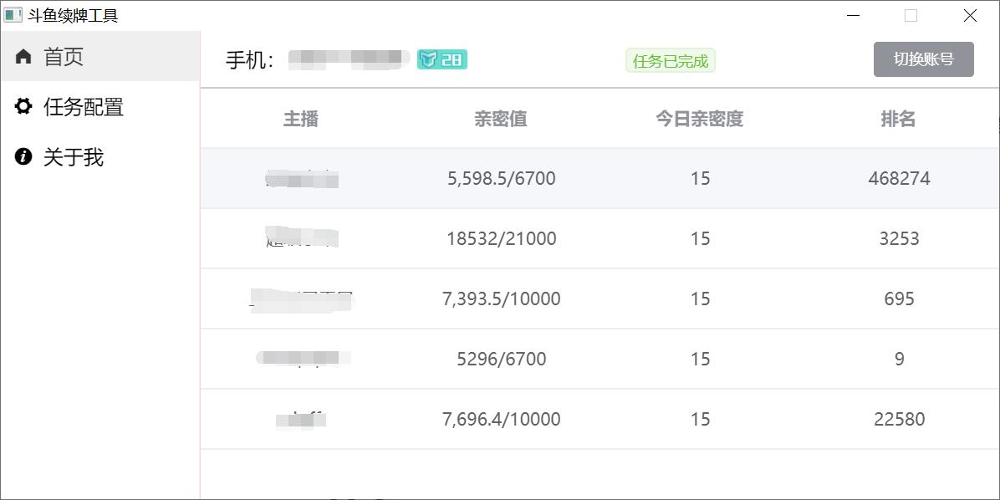

功能： 自动平均分配荧光棒，开机自动启动，任务完成后自动关闭软件。

[点击这里进行下载](https://github.com/Curtion/douyu-gift/releases)

# 说明

使用 Vue + ElementUI + TypeScript 驱动，仅用于学习用途。这是第二版，第一版使用了 jQuery + Electron；
第二版从代码上更清晰，但是功能不变，仍然只是自动赠送荧光棒。

当前 releases 只构建了 Windows X86_64 版本，如果需要 Linux 或者 Mac 版本请在`vue.config.js`配置，[相关配置文档](https://nklayman.github.io/vue-cli-plugin-electron-builder/guide/configuration.html#configuring-electron-builder)

# 克隆

`https://github.com/Curtion/douyu-gift.git`

# 安装

`yarn install`

# 开发

`yarn electron:serve`

# 构建

`yarn electron:build`

# 感谢

